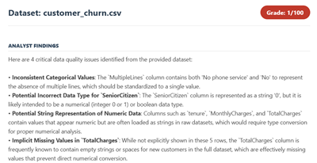
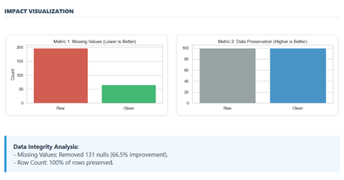

# CleanStream AI: The Data Wrangling Agent

---

### Contest Details
This project was built for the **Google AI Agents Intensive Hackathon (2025)**.
* **Contest URL:** [Kaggle Competition Page](https://www.kaggle.com/competitions/agents-intensive-capstone-project)
* **Track:** Enterprise Agents

---

### The Problem
Data Scientists spend **80% of their time cleaning data** instead of analyzing it.
Most companies try to fix this with standard coding scripts, but this fails because:
1.  **It takes too long:** Fixing thousands of files manually is impossible.
2.  **Scripts break easily:** If the date format changes from "DD-MM-YYYY" to "MM-DD-YYYY", a normal script crashes.
3.  **Human Error:** People get tired and make mistakes.

### The Solution
We built **CleanStream AI**. It is an automated team of "AI Employees" (Agents) that act as your personal Data Steward.

You simply give it a folder full of messy files (Healthcare, Sales, HR, etc.). The AI will:
1.  **Open** the files and see what is wrong.
2.  **Write its own code** to fix the errors.
3.  **Double-check** the work to make sure it is correct.
4.  **Create a Report** showing you exactly what it changed.

All of this happens automatically, without you typing a single line of code.

### Core Concepts and Technology

We used specific AI concepts to solve the problems listed above.

1. **Multi-Agent System** (The "Factory Line" Approach) - Instead of asking one AI to do everything, we split the job into three roles. This reduces confusion and improves quality.

 - *The Problem:* One AI often forgets instructions when the task is too big.
 - *Our Solution:* We have an Analyst (who thinks), a Coder (who works), and a Reviewer (who checks).

2. **Tool Use** (Real Coding) - Most AI chat bots just write text. Our agent is different because it can actually use tools.

- *The Problem:* AI often hallucinates (guesses) the data.
- *Our Solution:* Our Coder Agent writes real Python scripts and runs them on your computer. It does not guess the result; it calculates it.

3. **Google Gemini 2.5 Flash** - We chose this specific model to power our agents.

- Why? It is optimized for speed and coding. Since we process batches of files, we need an AI that thinks fast and writes accurate Python code.

### Architecture

Here is how the data flows through our system.

The Workflow:

- Input: You place raw CSV files into the input folder.
- Analyst Agent: It scans the first few rows of the data. It makes a list of errors (like missing values or bad dates).
- Coder Agent: It takes that list and writes a Python script to fix those specific errors. It executes the script to save a clean file.
- Reviewer Agent: It compares the old file and the new file. It assigns a quality score (0 to 100) to ensure the job was done right.
- Output: You get clean files and a PDF report.

### Try this agent!

Follow these steps to get the agent running on your computer.

**Prerequisites:**

1. Python: You need Python installed on your computer (version 3.8 aor advance)
2. Google API Key:
- Go to [Google AI Studio](https://aistudio.google.com/).
- Log in with your Google account.
- Click on Get API key.
- Copy the key string.

**Installation and Usage:**

**Download the code:** Open your terminal and run the following command to clone the repository.

    git clone https://github.com/YOUR_USERNAME/cleanstream-ai.git
    cd cleanstream-ai

**Install the requirements:** This installs the libraries we need (like LangChain and Pandas).

    python -m pip install -r requirements.txt

**Get the data:** This agent has a script that automatically downloads 5 practice datasets for you. If you want to try this with your own data, you can skip this step and simply put your `.csv` files in `data --> raw` folder. 

    python setup_data.py

**Run the Agent:** This starts the process. It will ask for your API Key once the process is initiated. While you paste the API key it will not be visible, and then clean all the raw files and save the clean files in `data --> clean` folder.

    python main.py

---

## Highlight: Check out the Dashboard

---

This project includes an interactive **Impact Report**. This report serves as a `Flight Recorder` proving exactly what actions the AI performed on your data.

**What is inside the report?**

The report provides a card-style view for every dataset processed in the batch.

- **Analyst Findings:** A plain-English summary of the errors detected (e.g., "Found 200 null values in the Date column").
- **Reviewer Comments:** A verification check from the second agent confirming the fix was successful.
- **Quality Score:** A 0-100 grade assigned to the cleaning job.
-- Green: Excellent (High confidence fix).
-- Orange: Good (Standard fix).
-- Red: Needs Attention (Complex issue).

***Take a look to sample report card!***

**visualize the impact**

To visualize the impact clearly, the dashboard generates two key charts for every file:

- **Missing Values Chart (Left):** This bar chart compares the count of missing (null) values before and after cleaning. A successful run shows the red bar (Raw) being high and the green bar (Clean) being zero or significantly lower.
- **Row Preservation Chart (Right):** This chart ensures safety. It compares the total number of rows. Ideally, these bars should be equal, proving that the AI fixed the data without deleting it.

***Take a look to sample charts!***

Below the charts, the dashboard provides a generated text summary. It calculates the exact percentage of improvement (e.g., "The agent removed 100% of missing values"). This allows non-technical stakeholders to understand the value of the automation immediately.

---

### Conclusion

CleanStream AI demonstrates that autonomous agents are ready to solve real enterprise problems. By combining the reasoning power of Google Gemini with actual code execution tools, we transformed a slow, manual chore into a fast, reliable workflow. This project proves that AI can act as a trustworthy partner in managing data infrastructure.

---

### About the Author

Vrunda Gadesha is a writer and technology enthusiast focused on simplifying complex AI concepts. She explores the intersection of storytelling and Deep Learning, helping readers understand the practical applications of Large Language Models.

- **Portfolio:** [View Articles](https://www.ibm.com/think/author/vrunda-gadesha)
- **LinkedIn:** [Connect with Vrunda](https://www.linkedin.com/in/vrunda-gadesha)
- **Newsletter:** [The Deep Think Bulletin](https://www.linkedin.com/newsletters/7349767581655846914/)

